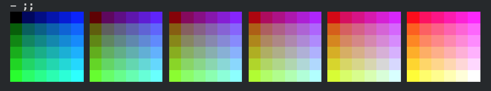

After releasing [ColoredPrintf][coloredprintf] I started investigating color terminals, especially how some terminals
can display more than the traditional 16 colors.

While on windows console colors are changed using a call to the
[`SetConsoleTextAttribute`][msdn_consoletextattr] API, on unix XTerm and other terminals follow the way the VT100
physical terminal did it with special [escape sequences][wikipedia] that are sent to the terminal but change it's
behavior instead of being displayed.

It is especially interesting as such terminals are becomming more and more present, even in the windows world. The
excelent [ConEmu][conemu] support lot of the codes, the venerable `cmd.exe` can be told to interpret them (as we'll
see later) and it'll even soon [gain True Color support too][windows10truecolor].

Using F# to play escape sequences
---------------------------------

Escape sequences are generated by printing the **`ESC`** (`0x1B)` character followed by at least another character.
The common ones are started with the `[` ( The **`ESC[`** is known as CSI) followed by parameters and ending with
a command character. The full list is on [Wikipedia][wikipedia] or [MSDN][msdn_vt100].

The cool thing is that [Visual Studio Code][vscode] integrated terminal support most of them and that the REPL
provided by the [Ionide plugin][ionide] uses it. So we can use the F# REPL integrated in VS Code to test that,
cool !

```fsharp
let esc = string (char 0x1B)
System.Console.WriteLine(esc + "[31;1m" + "Hello world" + esc + "[0m")
```

Will display `Hello World` in bright red as `m` is the graphic command taking sub-commands separated by `;`,
`31` is the red color and `1` signal that we want bold/bright text. And at the end `0` is the reset sub-command,
without it VSCode terminal would stay red.

Using `kprintf` we can create a printf-like function and start implementing a few of the escape sequences :

```fsharp
let csi = esc + "["
let printsequencef f = Printf.kprintf (fun s -> System.Console.Write(esc + s)) f
let printcsif f = Printf.kprintf (fun s -> System.Console.Write(csi + s)) f
let selectGraphicRendition (gr: int list) = printcsif "%sm" (System.String.Join(";", gr |> Seq.map string))
let resetColor() = selectGraphicRendition [0]
let setForeground i = selectGraphicRendition([30 + i])
let setBackground i = selectGraphicRendition([40 + i])
```

We need to be true to our colors
--------------------------------

Until then we've done nothing very interesting, after all the .Net console already support changing the console
color to bright red, nothing new under the sun. But what the .Net console or Windows native API doesn't support
is the `38` and `48` graphics sub-commands, extended foreground an background colors.

```fsharp
let setExtendedForeground i = selectGraphicRendition [38; 5; i]
let setExtendedBackground i = selectGraphicRendition [48; 5; i]
let setForegroundRgb r g b = selectGraphicRendition [38; 2; r; g; b]
let setBackgroundRgb r g b = selectGraphicRendition [48; 2; r; g; b]
```

The first variant accept an index in a 256 colors table and the second specify the R, G and B components.
All the terminals I tested support both of them but only a few really display True Color, most of them only find
the nearest color in their 256 color table and use that. Even `cmd.exe` support both but he finds the nearest
color in the 16 colors table and uses that.

Let's see what the palete looks like :

```fsharp
let extendedBlock i =
    for j in i..i+5 do
        setExtendedBackground j
        printf "  "

for row in 0..5 do
    for b in 0..5 do
        extendedBlock (16 + 36*b + row*6)
        resetColor()
        printf " "
    printfn ""
```



A note on ConEmu color support
------------------------------

ConEmu support more than the standard 16 colors but if you try it, it won't work
directly, it seem that maybe for compatibility reasons the support isn't always on.

To trigger it an application must first scroll the terminal far away at least once
with the `T` command .

```fsharp
let scrollUp (lines: int) = printcsif "%iS" lines
let scrollDown (lines: int) = printcsif "%iT" lines
scrollDown 9999
setCursorPos 9999 1
```

After that ConEnu will display what we expect :

  

Enabling escape code in `cmd.exe`
---------------------------------

While the windows terminal support escape codes, it doesn't do it directly. They need
to be enabled using `SetConsoleMode` API :

```fsharp
#nowarn "9"
module DllImports =
    open System.Runtime.InteropServices
    open Microsoft.FSharp.NativeInterop

    let INVALID_HANDLE_VALUE = nativeint -1
    let STD_OUTPUT_HANDLE = -11
    let ENABLE_VIRTUAL_TERMINAL_PROCESSING = 0x0004

    [<DllImport("Kernel32")>]
    extern void* GetStdHandle(int nStdHandle)

    [<DllImport("Kernel32")>]
    extern bool GetConsoleMode(void* hConsoleHandle, int* lpMode)

    [<DllImport("Kernel32")>]
    extern bool SetConsoleMode(void* hConsoleHandle, int lpMode)

    let enableVTMode() =
        let handle = GetStdHandle(STD_OUTPUT_HANDLE)
        if handle <> INVALID_HANDLE_VALUE then
            let mode = NativePtr.stackalloc<int> 1
            if GetConsoleMode(handle, mode) then
                let value = NativePtr.read mode
                let value = value ||| ENABLE_VIRTUAL_TERMINAL_PROCESSING
                SetConsoleMode(handle, value)
            else
                printfn "no get"
                false
        else
            printfn "no handle"
            false

DllImports.enableVTMode() |> ignore
```

Let's implement a few of the fun color codes in F#,
but we'll play

[ionide]: http://ionide.io/
[vscode]: https://code.visualstudio.com/
[conemu]: https://conemu.github.io/
[coloredprintf]: https://github.com/vbfox/ColoredPrintf
[wikipedia]: https://en.wikipedia.org/wiki/ANSI_escape_code
[msdn_vt100]: https://msdn.microsoft.com/en-us/library/windows/desktop/mt638032(v=vs.85).aspx
[msdn_consoletextattr]: https://msdn.microsoft.com/en-us/library/windows/desktop/ms686047(v=vs.85).aspx
[windows10truecolor]: https://blogs.msdn.microsoft.com/commandline/2016/09/22/24-bit-color-in-the-windows-console/
